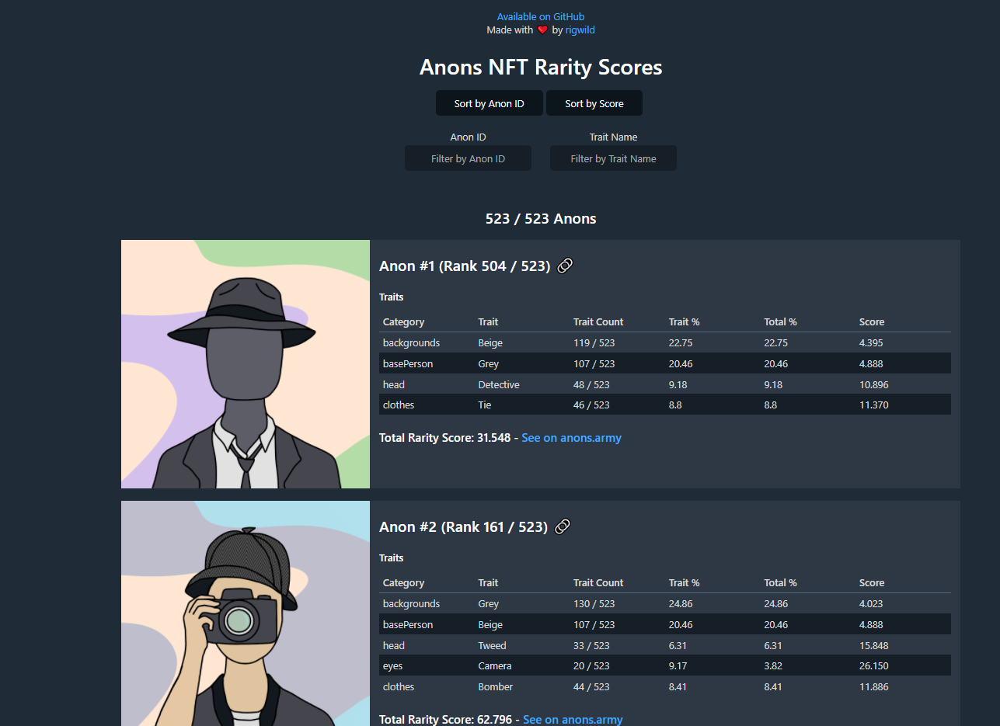

# Anons NFT Rarity Scores

This repository will list every rarity score for each Anons NFTs from https://www.anons.army/ on the [Secret Network](https://scrt.network/).

The rarity score is calculed following [these formulas (`Rarity Score: How is it Calculated?` section)](https://raritytools.medium.com/ranking-rarity-understanding-rarity-calculation-methods-86ceaeb9b98c#2942).

A rarity score can be calculated in a lot of different ways with each their specifics strengths and flaws. **This is not an official ranking.**

Any non-traits is treated like it was the trait "None". It counts in scores.

## Raw Rarity Scores

- Human-readable version: [`_output_results.log`](./_output_results.log)
- JSON:
  - [`_output_anonsNullTraitsAsNone.json`](./_output_anonsNullTraitsAsNone.json): Anons with `null` traits set to `None`
  - [`_output_rarity.json`](./_output_rarity.json): Rarity scores
- Human-readable version: [`_results.log`](./_results.log)
- JSON: [`_rarity.json`](./_rarity.json), [`_anons.json`](./_anons.json)

## Reproduce calculations

The script will use local cached versions if available. To load everything from the https://www.anons.army/ API, remove every files named `_input_<name>.json`.

```sh
pnpm install
pnpm build
pnpm exportScores
```

SHA256 hashes:

```
$ sha256sum _*
f8d2dafbc207ac3aeae38e0cbad8a1c24badb28c0ca4f1b5078f04ad3e2d26fe  _input_anons.json
0b189af4d9df843850d5ed364ee86da12c54d5b882afcb8409656f4e72d32c1e  _input_traits_backgrounds.json
9a224046f5fc39c53ef2b51a103abaa143ff1939a3ade7eda959bf441feb147b  _input_traits_base-persons.json
7ece8aac7d83948c5372382855b3661439ba14873fdb31ccbb23164aed8b2040  _input_traits_clothes.json
e83356417c1903fa45db6e5f480eaad926a82d5b34b093f50b62e3e8841ed259  _input_traits_ears.json
35d7e6e2bd85ff708684e76ff59e7fc9cad797af6326fedc2ded4a153d5590f7  _input_traits_eyes.json
c80bf523563dfe65b18ec8bc5163104460e98eded12d6b5a4a934a851574ce1c  _input_traits_heads.json
feea28bb4740f8f3c116741721abd7f9f272db16eb0ee3b21fb62739afca52d6  _input_traits_mouths.json
52d354e191e61aacda387d1297a85cab3542dbbcb6cc48fd7412e69cb1ff6d78  _output_anonsNullTraitsAsNone.json
c1dca3b87cb0f3d3f2a734c07bdfb821e8acb047346dad524bf24d66345e22fa  _output_rarity.json
0b60d8731387099c59c9a87f0491eff3d216ad7035c60cdf7c4680be33d4aa32  _output_results.log
```

## Website

A website is available at https://anons.rigwild.dev/



## License

[The MIT License](./LICENSE)
